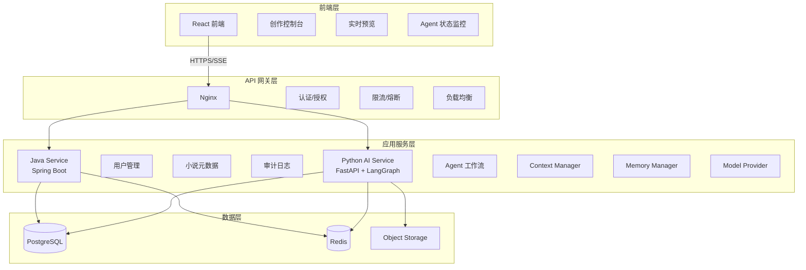
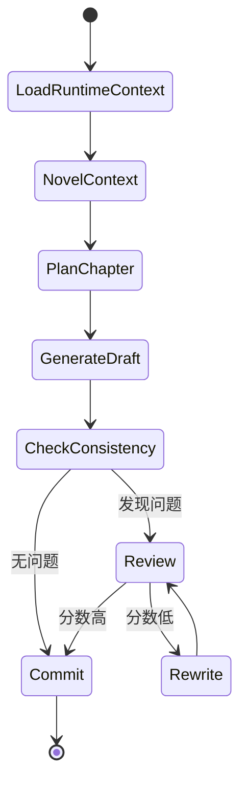
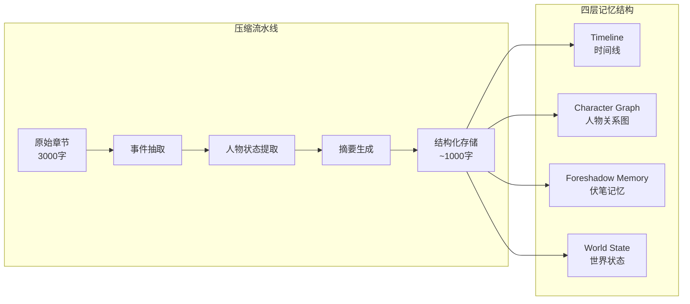
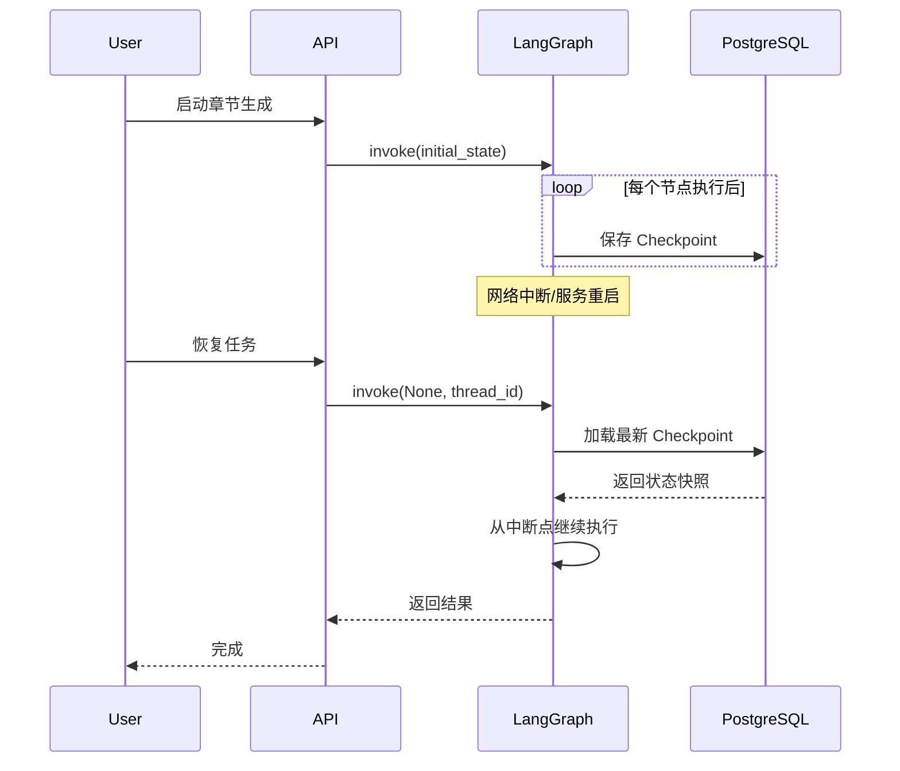
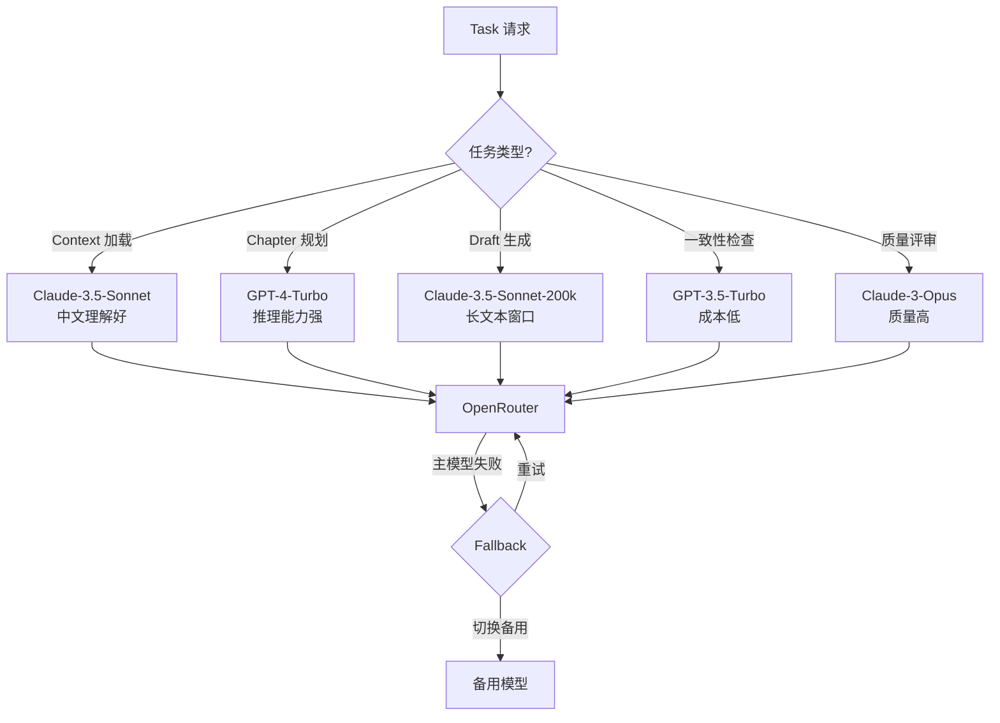
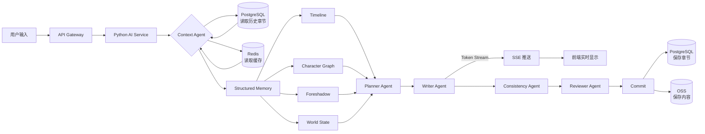
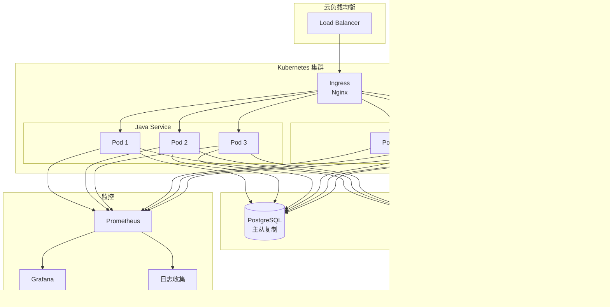
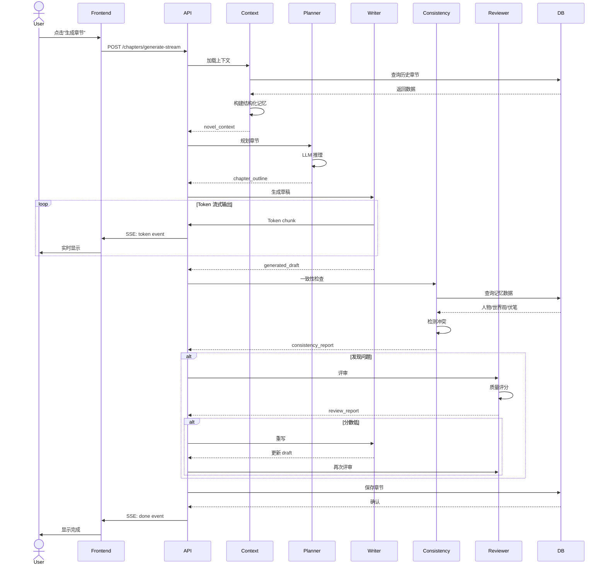
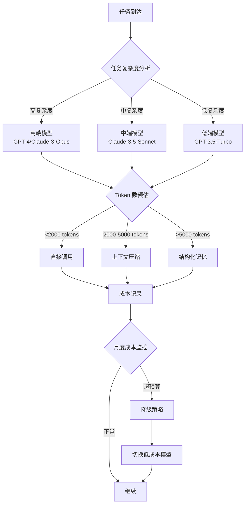
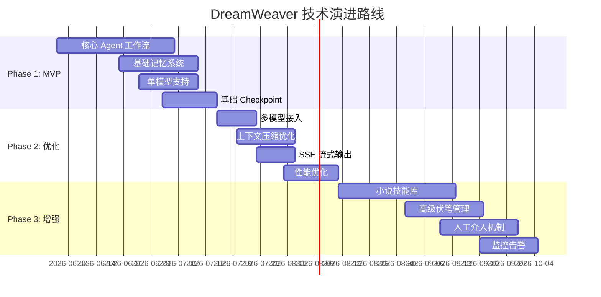

# DreamWeaver 架构可视化

本文档提供 DreamWeaver 项目的可视化架构图。

---

## 1. 系统总体架构

---

## 2. Agent 工作流状态机

---

## 3. 结构化记忆系统

---

## 4. Checkpoint 恢复机制

---

## 5. 多模型路由策略

---

## 6. 数据流图

---

## 7. 部署架构（生产环境）

---

## 8. 时序图：完整章节生成流程

---

## 9. 成本优化流程

---

## 10. 技术演进路线图

---

## 图例说明

### 节点类型
- 🟦 **蓝色方框**: 服务/组件
- 🟨 **黄色菱形**: 决策点
- 🟩 **绿色圆角**: 数据存储
- 🟪 **紫色圆形**: 外部系统

### 连接类型
- **实线箭头**: 同步调用
- **虚线箭头**: 异步调用
- **双向箭头**: 双向通信

---

## 如何查看图表

本文档使用 Mermaid 语法编写图表。可以通过以下方式查看：

1. **GitHub**: 直接在 GitHub 上查看（自动渲染 Mermaid）
2. **VS Code**: 安装 Mermaid 插件
3. **在线工具**: [Mermaid Live Editor](https://mermaid.live/)
4. **Markdown 编辑器**: Typora、Mark Text 等支持 Mermaid

---

## 相关文档

- [系统架构设计文档](./system-architecture.md)
- [技术选型总结](./tech-stack.md)
- [架构决策记录 (ADR)](./adr/)

---

**最后更新**: 2026-06-04
